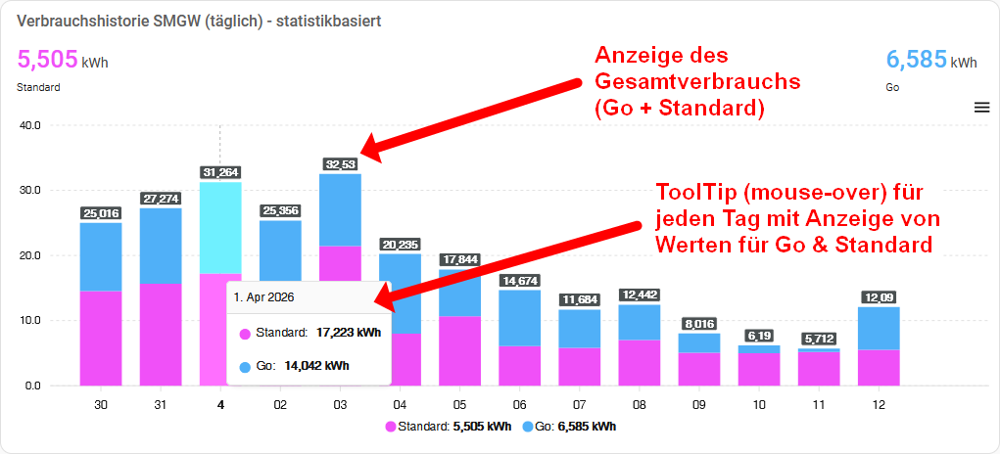

# ha-ppc-smgw-han

**Home Assistant custom integration for reading __certified daily meter values__ from PPC Smart Meter Gateways via the HAN interface.**

<a href="README.md">Deutsche Version</a>

 

## What it does

This integration connects to your PPC SMGW once per day and retrieves the official, calibration-grade daily meter readings from the Zählerstand (meter readings) endpoint. It calculates:

- **Daily consumption (total)** — total electricity consumed
- **Daily consumption (slot 1)** — consumption during the first tariff period (default: 00:00–04:59)
- **Daily consumption (slot 2)** — consumption during the second tariff period (default: 05:00–23:59)
- **Daily feed-in (total)** — total electricity fed back to grid

All sensors are compatible with the Home Assistant **Energy Dashboard**.

## How does this differ from ha-ppc-smgw?

The existing [ha-ppc-smgw](https://github.com/jannickfahlbusch/ha-ppc-smgw) integration polls current meter readings at fixed 10 minute intervals (ignoring the respective user setting during setup). Some users have reported being locked out of their SMGW, because the frequency of requests was deemed as too high by the SMGW. So this integration takes a different approach:

- **One fetch per day** (5 HTTP requests total, at a configurable time — eliminating any risk of being locked out by the SMGW due to excessive polling)
- **Certified values** from the SMGW's Zählerstand endpoint (not live meter snapshots)
- **Accurate tariff split** using the second-precise meter reading at the configured tariff switch time
- **No timing issues** — values are based on the SMGW's official daily boundaries, not the local clock of the Home Assistant server

## Requirements

- PPC Smart Meter Gateway with HAN interface enabled
- HAN credentials (username + password) from your electricity provider (MSB)
- Your Home Assistant server and the SMGW must be able to reach each other via IP.

> [!TIP]
> **A SIMPLE SOLUTION FOR THE SMGW IP ROUTING PROBLEM:**
> _(Making Home Assistant and the SMGW reachable in the same IP range)_
>
> The SMGW is permanently fixed at `192.168.100.100`, while Home Assistant typically runs on a local IP like `192.168.2.x` or similar.
> The [network setup guide](docs/network-setup.en.md) explains how to easily assign your HA server
> a second IP address in the `192.168.100.x` range to establish the connection.

## Installation

### HACS (recommended)

1. Open HACS in Home Assistant
2. Go to Integrations → three-dot menu → Custom repositories
3. Add `https://github.com/TRON4R/ha-ppc-smgw-han` as an Integration
4. Install "PPC SMGW HAN Daily Import"
5. Restart Home Assistant

### Manual

1. Copy `custom_components/smgw_han/` to your Home Assistant `custom_components/` directory
2. Restart Home Assistant

## Configuration

1. Go to Settings → Devices & Services → Add Integration
2. Search for "PPC SMGW"
3. Enter:
   - **URL**: Your SMGW HAN interface URL (default: `https://192.168.100.100/cgi-bin/hanservice.cgi`)
   - **Username** and **Password**: Your HAN credentials
   - **Standard tariff start time**: When the standard tariff begins (default: 05:00, configurable)
   - **Fetch time**: Time of the daily data fetch (default: 00:15)

## Sensors

| Sensor | Description | Device Class | State Class |
|---|---|---|---|
| Daily consumption total | Yesterday's total consumption | `energy` | `total` |
| Daily consumption slot 1 | Consumption during slot 1 (midnight → tariff switch) | `energy` | `total` |
| Daily consumption slot 2 | Consumption during slot 2 (tariff switch → midnight) | `energy` | `total` |
| Daily feed-in total | Yesterday's total feed-in | `energy` | `total` |
| Meter consumption previous day closing | Absolute reading at start of day (00:00) | `energy` | `total_increasing` |
| Meter consumption tariff switch 1 | Absolute reading at tariff switch time | `energy` | `total_increasing` |
| Meter feed-in previous day closing | Absolute export reading at start of day (00:00) | `energy` | `total_increasing` |
| Daily date | Date of the last fetched data | `date` | — |

## Dashboard card: Daily consumption history

**Prerequisite:** [ApexCharts Card](https://github.com/RomRider/apexcharts-card) (installable via HACS)

The card displays the last 30 days as a stacked bar chart:
- **Go** (blue): Consumption during the discounted tariff slot (slot 1)
- **Standard** (pink): Consumption during the standard tariff slot (slot 2)
- Tooltip (mouse-over): Individual values per tariff segment per day
- Header: Cumulative total per segment over the displayed period

### How to add it

1. Download [`dashboard/verbrauchshistorie_taeglich.yaml`](dashboard/verbrauchshistorie_taeglich.yaml)
2. In Home Assistant: Dashboard → Add card → Manual card
3. Paste the YAML and adjust the entity IDs to match yours:
   - `sensor.octopus_smgw_tagesverbrauch_zeitfenster_2` → your entity ID for slot 2
   - `sensor.octopus_smgw_tagesverbrauch_zeitfenster_1` → your entity ID for slot 1

You can find your entity IDs under **Settings → Devices & Services → Entities**.

## Intended use case

This integration was developed for the **Octopus Energy Go tariff** in Germany, which offers a reduced electricity rate between **00:00 and 04:59:59** (Go tariff) and a standard rate from **05:00 to 23:59:59**. The tariff split time is configurable. If you are using a very different tariff structure or a totally different tariff switch time, please [open an issue](https://github.com/TRON4R/ha-ppc-smgw-han/issues) or ideally a [pull request](https://github.com/TRON4R/ha-ppc-smgw-han/pulls) to discuss how to make this work for your setup.

## License

MIT License — see [LICENSE](LICENSE) for details.
