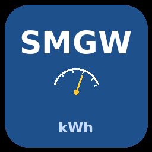

# ha-ppc-smgw-han

**Home Assistant Custom Integration zum Abruf __geeichter Tagesendwerte__ von PPC Smart Meter Gateways über die HAN-Schnittstelle.**

**EN: Home Assistant custom integration for reading certified daily meter values from PPC Smart Meter Gateways via the HAN interface.**

 

## Was macht diese Integration?

Die Integration verbindet sich einmal täglich mit dem PPC SMGW und ruft die offiziellen, eichrechtskonformen Tagesendwerte vom Zählerstand-Endpunkt ab. Sie berechnet:

- **Tagesverbrauch (gesamt)** — gesamter Stromverbrauch des Vortags
- **Tagesverbrauch (Zeitfenster 1)** — Verbrauch im ersten Tarifzeitraum (Standard: 00:00–04:59)
- **Tagesverbrauch (Zeitfenster 2)** — Verbrauch im zweiten Tarifzeitraum (Standard: 05:00–23:59)
- **Tageseinspeisung (gesamt)** — gesamte Netzeinspeisung des Vortags

Alle Sensoren sind kompatibel mit dem Home Assistant **Energie-Dashboard**.

## Unterschied zu ha-ppc-smgw

Die bestehende [ha-ppc-smgw](https://github.com/jannickfahlbusch/ha-ppc-smgw)-Integration fragt aktuelle Zählerstände in festen 10-Minuten-Intervallen ab (unabhängig von der Nutzereinstellung beim Setup). Einige Nutzer berichten, dass sie vom SMGW gesperrt wurden, weil die Abfragehäufigkeit als zu hoch eingestuft wurde. Diese Integration verfolgt einen anderen Ansatz:

- **Ein Abruf pro Tag** (5 HTTP-Requests insgesamt, zu einer konfigurierbaren Uhrzeit)
- **Geeichte Werte** vom Zählerstand-Endpunkt des SMGW (keine Live-Momentaufnahmen)
- **Exakte Tarifaufteilung** anhand des genauen Zählerstands zum konfigurierbaren Tarifwechselzeitpunkt
- **Keine Timing-Probleme** — die Werte stammen aus den Tagesgrenzen des SMGW, nicht aus der HA-Uhr

## Voraussetzungen

- PPC Smart Meter Gateway mit aktivierter HAN-Schnittstelle
- HAN-Zugangsdaten (Benutzername + Passwort) vom Messstellenbetreiber

## Installation

### HACS (empfohlen)

1. HACS in Home Assistant öffnen
2. Integrationen → Drei-Punkte-Menü → Benutzerdefinierte Repositories
3. `https://github.com/TRON4R/ha-ppc-smgw-han` als Integration hinzufügen
4. „PPC SMGW HAN Daily Import" installieren
5. Home Assistant neu starten

### Manuell

1. `custom_components/smgw_han/` in das `custom_components/`-Verzeichnis von Home Assistant kopieren
2. Home Assistant neu starten

## Konfiguration

1. Einstellungen → Geräte & Dienste → Integration hinzufügen
2. Nach „PPC SMGW" suchen
3. Eingeben:
   - **URL**: URL der SMGW HAN-Schnittstelle (Standard: `https://192.168.100.100/cgi-bin/hanservice.cgi`)
   - **Benutzername** und **Passwort**: HAN-Zugangsdaten
   - **Start Standard-Tarif**: Uhrzeit des Tarifwechsels (Standard: 05:00, konfigurierbar)
   - **Abrufzeit**: Uhrzeit des täglichen Datenabrufs (Standard: 00:15)

## Sensoren

| Sensor | Beschreibung | Device Class | State Class |
|---|---|---|---|
| Tagesverbrauch gesamt | Gesamtverbrauch des Vortags | `energy` | `total` |
| Tagesverbrauch Zeitfenster 1 | Verbrauch Zeitfenster 1 (Mitternacht → Tarifwechsel) | `energy` | `total` |
| Tagesverbrauch Zeitfenster 2 | Verbrauch Zeitfenster 2 (Tarifwechsel → Mitternacht) | `energy` | `total` |
| Tageseinspeisung gesamt | Gesamteinspeisung des Vortags | `energy` | `total` |
| Zählerstand Verbrauch Endstand Vortag | Absoluter Zählerstand zu Tagesbeginn (00:00) | `energy` | `total_increasing` |
| Zählerstand Verbrauch Tarifwechsel 1 | Absoluter Zählerstand zum Tarifwechselzeitpunkt | `energy` | `total_increasing` |
| Zählerstand Einspeisung Endstand Vortag | Absoluter Einspeise-Zählerstand zu Tagesbeginn (00:00) | `energy` | `total_increasing` |
| Tagesdatum | Datum der zuletzt abgerufenen Daten | `date` | — |

## Anwendungsfall

Diese Integration wurde für den **Octopus Energy Go-Tarif** in Deutschland entwickelt, der einen vergünstigten Strompreis zwischen **00:00 und 04:59:59** (Go-Tarif) und einen Normalpreis von **05:00 bis 23:59:59** bietet. Der Tarifwechselzeitpunkt ist konfigurierbar. Falls du eine völlig andere Tarifstruktur oder einen anderen Wechselzeitpunkt nutzt, eröffne bitte ein [Issue](https://github.com/TRON4R/ha-ppc-smgw-han/issues) oder besser einen [Pull Request](https://github.com/TRON4R/ha-ppc-smgw-han/pulls), damit wir gemeinsam eine Lösung finden.

## Lizenz

MIT-Lizenz — siehe [LICENSE](LICENSE) für Details.
