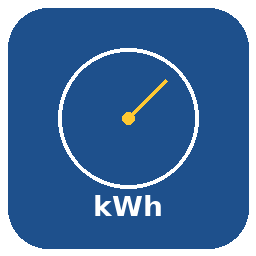

# ha-ppc-smgw-taf

Home Assistant custom integration for reading **certified daily meter values** from PPC Smart Meter Gateways via the HAN interface.

 

## What it does

This integration connects to your PPC SMGW once per day and retrieves the official, calibration-grade daily meter readings from the TAF7 evaluation profile. It calculates:

- **Daily grid import (total)** — total electricity consumed
- **Daily grid import (Go tariff)** — consumption during Octopus Go hours (00:00–04:59)
- **Daily grid import (Standard tariff)** — consumption during standard hours (05:00–23:59)
- **Daily grid export (total)** — total electricity fed back to grid

All sensors are compatible with the Home Assistant **Energy Dashboard**.

## How does this differ from ha-ppc-smgw?

The existing [ha-ppc-smgw](https://github.com/jannickfahlbusch/ha-ppc-smgw) integration polls current meter readings at regular intervals. Some users have reported being locked out of their SMGW due to the frequency of requests. This integration takes a different approach:

- **One fetch per day** (5 HTTP requests total, at a configurable time)
- **Certified values** from TAF7 interval readings (not live meter snapshots)
- **Accurate tariff split** using the exact 05:00 meter reading from the SMGW
- **No timing issues** — values come from the SMGW's own daily boundaries, not HA's clock

## Requirements

- PPC Smart Meter Gateway with HAN interface enabled
- HAN credentials (username + password) from your electricity provider
- A TAF7 evaluation profile configured in the SMGW (e.g., "TAF7_OCT_B+E")

## Installation

### HACS (recommended)

1. Open HACS in Home Assistant
2. Go to Integrations → three-dot menu → Custom repositories
3. Add `https://github.com/TRON4R/ha-ppc-smgw-taf` as an Integration
4. Install "SMGW Daily (TAF)"
5. Restart Home Assistant

### Manual

1. Copy `custom_components/smgw_taf/` to your Home Assistant `custom_components/` directory
2. Restart Home Assistant

## Configuration

1. Go to Settings → Devices & Services → Add Integration
2. Search for "SMGW Daily"
3. Enter:
   - **URL**: Your SMGW HAN interface URL (default: `https://192.168.100.100/cgi-bin/hanservice.cgi`)
   - **Username** and **Password**: Your HAN credentials
   - **TAF7 profile name**: The name of your TAF7 evaluation profile (default: `TAF7_OCT_B+E`)
   - **Fetch time**: Hour and minute for the daily data fetch (default: 00:15)

## Sensors

| Sensor | Description | State Class |
|---|---|---|
| Daily import total | Yesterday's total consumption | `total` |
| Daily import Go tariff | Consumption 00:00–04:59 | `total` |
| Daily import Standard tariff | Consumption 05:00–23:59 | `total` |
| Daily export total | Yesterday's total feed-in | `total` |
| Meter import (0:00) | Absolute reading at 00:00 | `total_increasing` |
| Meter import (5:00) | Absolute reading at 05:00 | `total_increasing` |
| Meter export (0:00) | Absolute reading at 00:00 | `total_increasing` |
| Daily date | Date of the last fetched data | — |

The meter reading sensors are disabled by default and can be enabled in the entity settings if needed.

## License

MIT License — see [LICENSE](LICENSE) for details.
