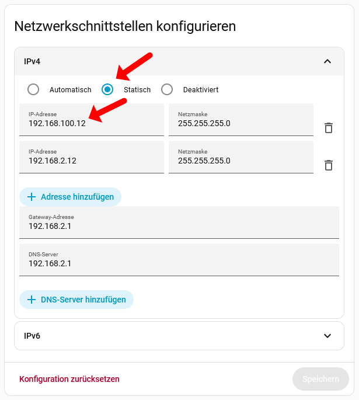

# Network Setup: Connecting Home Assistant to the SMGW

The PPC Smart Meter Gateway is permanently configured to use IP `192.168.100.100` — this cannot be changed. Home Assistant typically runs on your router's local network, e.g. on an address like `192.168.2.12`. Since these two network ranges cannot communicate directly, the easiest and most elegant solution is to assign your Home Assistant server a second IP address from the `192.168.100.x` range. Here's how:

## Adding a second IP address in Home Assistant

1. _**Settings → System → Network**_
2. Open the _Configure network interfaces_ section and expand _IPv4_
3. Select _Static_ (if not already active — this is required because _Automatic_ (DHCP) and multiple IP addresses are mutually exclusive in HA)
4. Click _+ Add address_
5. In the new field (showing 0.0.0.0) enter the new _IP address_, e.g. `192.168.100.12`
   - The last number (here `12`) can be anything you like, as long as that IP is not already taken in the `192.168.100.x` range. Normally this range should be empty except for `192.168.100.100` (the SMGW itself).
   - Be careful not to accidentally fill in the wrong field and cut off your own access.
6. Check that the _Netmask_ is `255.255.255.0` (should be correct automatically)
7. _**Save**_

**When done, it should look like this:**

**That's all there is to it.** Your Home Assistant server can now talk directly to the SMGW — no complicated routes, VLANs, or restructuring of your entire home network required.
All that's left is to start the SMGW integration, which should then successfully connect to the SMGW.

## Notes

- Of course, the HAN port of the SMGW must be connected via LAN cable to the same switch that the Home Assistant server is connected to. If Home Assistant is running in a virtual machine (e.g. on a NAS such as Synology or QNAP), the IP address or IP range of the NAS itself does not matter. What matters is only that Home Assistant itself has this additional IP address in the SMGW's IP range active.
- A restart of Home Assistant may be required after saving for the change to take effect.
- Depending on your setup (VM, host system), a full reboot of the virtual machine or the host computer may be needed for the new IP to become active.
- The new IP does **not** need to be entered as the SMGW URL — that stays `https://192.168.100.100/cgi-bin/hanservice.cgi`. The second IP simply allows Home Assistant to reach `192.168.100.100` at all, without any complicated routing tables.
- If you also want to access the SMGW web interface from your PC's browser, you'll need to give your PC a second IP in the `192.168.100.x` range as well — different from both `.100` (SMGW) and the one assigned to Home Assistant. Any AI assistant (ChatGPT, Claude, Gemini, etc.) can walk you through how to do this on Windows, macOS, or Linux.
- All my attempts to embed the SMGW web interface inside Home Assistant (e.g. as an iFrame card, to avoid giving my PC a second IP) have failed. The BSI has locked down the SMGW completely. As someone once aptly put it: these gateways would successfully repel an attack from Mars. iFrame embedding is blocked, stripping the `X-FRAME-OPTIONS: deny` header via an Nginx proxy doesn't help either — you authenticate successfully and then get immediately kicked out due to session cookies and other security measures. The SMGW doesn't even respond to a simple `ping`. **If you find a solution that works reliably inside HA, please let us know!**
